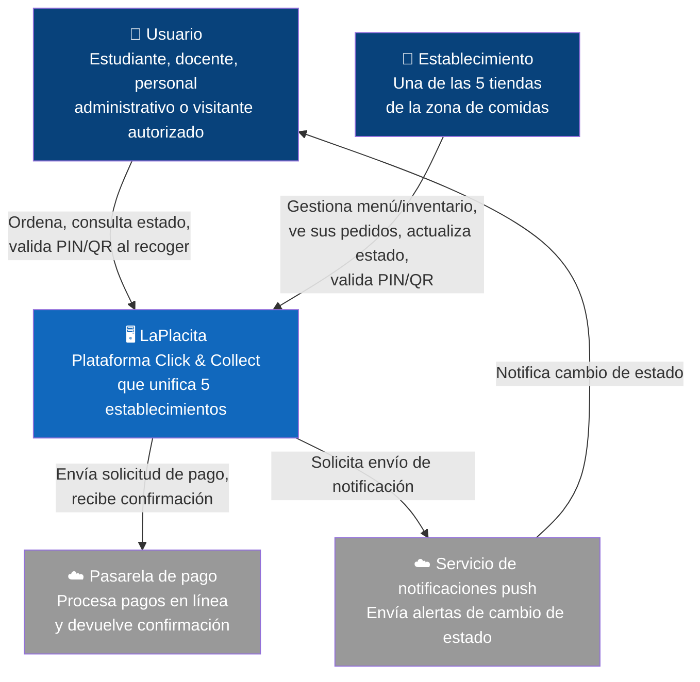

## 1. Introducción y Objetivos

### 1.1 Resumen de Requisitos

LaPlacita es una plataforma móvil de tipo Click & Collect que unifica la oferta de las 5 tiendas de la zona de comidas del campus universitario. Permite a estudiantes, docentes, personal administrativo y visitantes autorizados pre-ordenar productos de cualquiera de los 5 establecimientos, consultar menús e inventario en tiempo real, monitorear el estado de preparación mediante notificaciones en 4 etapas (Recibido → En preparación → Listo para recoger → Entregado), y retirar el pedido en mostrador validando su identidad con un PIN de 4 dígitos. El objetivo central es reducir el tiempo de espera presencial durante las horas pico, sin perder trazabilidad ni seguridad en la entrega.

### 1.2 Objetivos de Calidad

| Prioridad | Atributo | Aspecto relacionado | Motivo |
|---|---|---|---|
| 1 | Disponibilidad y consistencia | A-01 | El sistema debe seguir aceptando y actualizando pedidos correctamente durante los picos de demanda entre clases, sin perder ni duplicar información |
| 2 | Aislamiento entre establecimientos | A-02 | Al ser 5 negocios independientes compartiendo la plataforma, un pedido o dato mal enrutado genera errores operativos y desconfianza entre vendedores |
| 3 | Integridad de la validación en el punto de recolección | A-06 | El PIN es el único control de seguridad del flujo; si puede vulnerarse, cualquiera podría recoger un pedido ajeno |
| 4 | Protección de datos personales y de pago | A-04 | El sistema maneja identidad institucional y confirmaciones de pago; una exposición indebida afecta a toda la comunidad universitaria |
| 5 | Usabilidad / simplicidad del flujo | A-05 | Los usuarios disponen de ventanas cortas (5-10 min entre clases); un flujo con fricción desincentiva el uso de la plataforma |

### 1.3 Stakeholders

| Interesado | Rol / interés | Expectativa principal |
|---|---|---|
| Estudiantes, docentes, personal administrativo, visitantes autorizados | Ordenan y recogen productos | Pedido correcto, listo cuando se les notifica, sin filas |
| Las 5 tiendas/establecimientos de LaPlacita | Reciben, preparan y entregan pedidos | Ver solo sus propios pedidos/menú/inventario, sin mezcla con otros negocios |
| Equipo de desarrollo (Buendía Barrios Mateo, Isaza Montalvo Miguel, Jimenez Alvarez Samuel, Martinez Castillo Jorge) | Construye y mantiene el sistema | Arquitectura simple de sostener con 4 personas |

## 2. Restricciones de Arquitectura

| Restricción | Tipo | Justificación |
|---|---|---|
| Plataforma multi-establecimiento (5 tiendas independientes) | Funcional / negocio | El modelo de negocio agrupa negocios distintos bajo una sola app; obliga a diseñar con aislamiento de datos desde el inicio, no como añadido posterior |
| Validación de entrega con PIN de 4 dígitos | Funcional / negocio | Es el único punto de control de identidad en el flujo, ya que no hay verificación durante la navegación o el pago |
| Confirmación de pago sin almacenar datos sensibles de tarjeta | Normativa / seguridad | El pago en línea pasa por una pasarela externa; el sistema solo debe guardar la confirmación, no los datos de la tarjeta (A-04) |
| Equipo de 4 integrantes | Organizacional | Limita las tácticas viables (por ejemplo, descarta una descomposición extensa en microservicios) |
| Entrega en un semestre académico | Organizacional / temporal | Obliga a priorizar los aspectos de mayor riesgo (A-01, A-02, A-04, A-06) sobre los de prioridad media |

## 3. Alcance y Contexto del Sistema

### 3.1 Contexto de Negocio

- **Usuario (estudiante/docente/personal/visitante)**: ordena, paga, consulta estado, recibe notificaciones, valida su identidad con PIN o QR al recoger.
- **Establecimiento (una de las 5 tiendas)**: gestiona su propio menú e inventario, recibe únicamente los pedidos que le corresponden, actualiza el estado, valida el PIN en la entrega.
- **Pasarela de pago externa**: procesa el pago en línea y devuelve una confirmación, sin exponer datos de tarjeta al sistema.

### 3.2 Contexto Técnico

- App móvil ↔ Backend de LaPlacita: vía API, con el establecimiento como dato de enrutamiento en cada pedido.
- Backend ↔ Pasarela de pago externa: integración para confirmar pagos en línea.
- Backend ↔ Servicio de notificaciones push: envío de las 4 etapas de estado.
- Panel de cada establecimiento ↔ Backend: misma API, con acceso restringido a su propia información.

### 3.3 Diagrama C4 de contexto

### 3.3 Diagrama C4 de contexto

