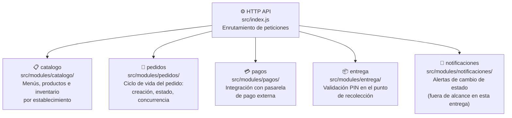
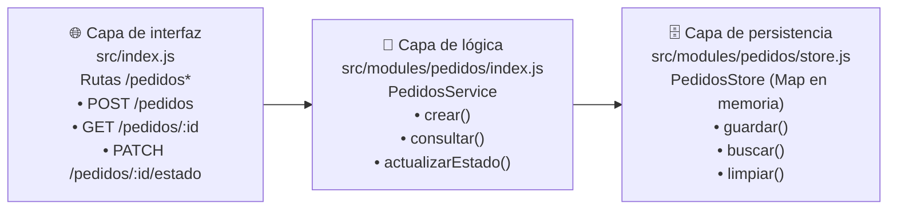
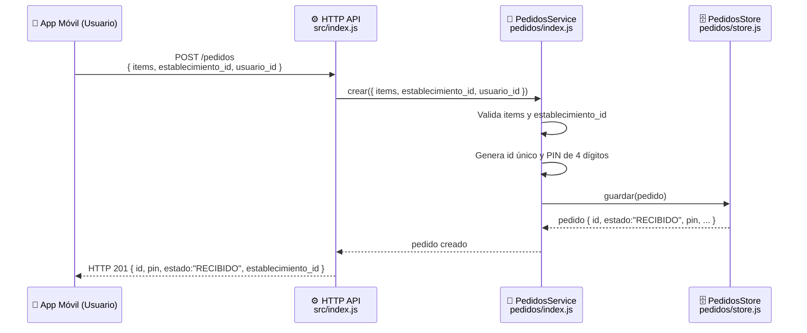
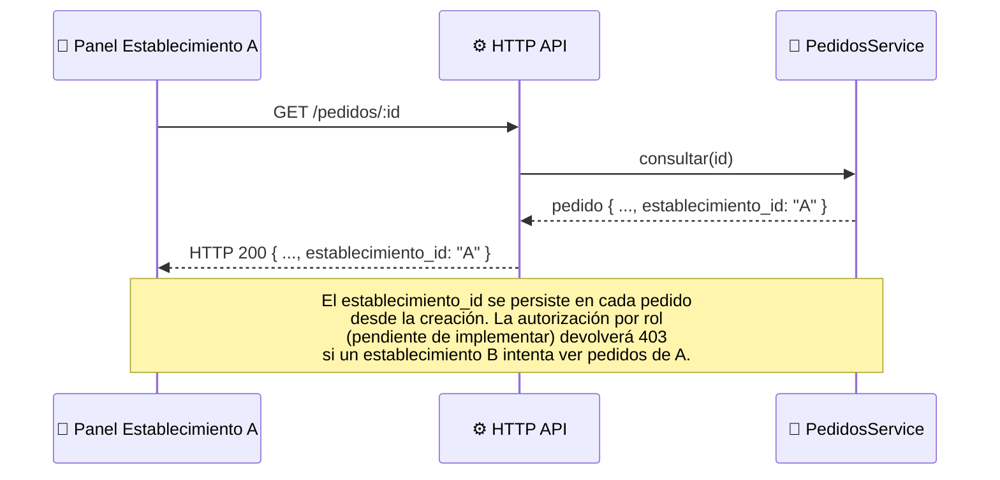
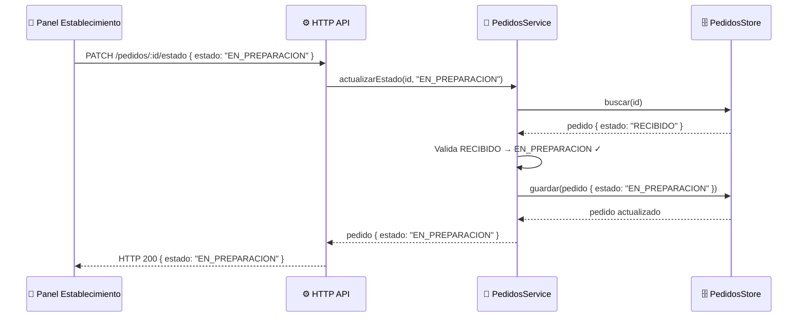
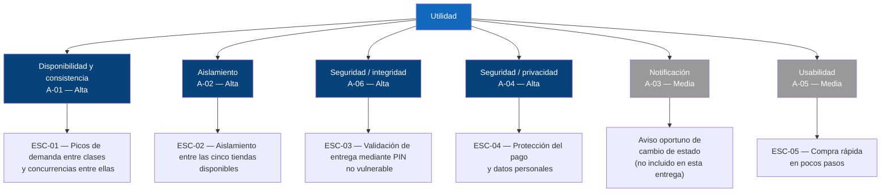

## 1. Introducción y Objetivos

### 1.1. Resumen

LaPlacita es una plataforma móvil de tipo **Click & Collect** que unifica la oferta de las 5 tiendas de la zona de comidas del campus universitario. Permite a estudiantes, docentes, personal administrativo y visitantes autorizados: 

- Consultar los menús de las 5 tiendas.
- Consultar la disponibilidad de productos e inventario. 
- Pre-ordenar productos de cualquiera de los 5 establecimientos 
-  Monitorear el estado de preparación mediante notificaciones en 4 etapas (Recibido → En preparación → Listo para recoger → Entregado).
- Retirar el pedido en mostrador validando su identidad con un PIN de 4 dígitos.
 
El objetivo central es reducir el tiempo de espera presencial durante las horas pico, especialmente en los intervalos de 5 a 10 minutos entre clases, sin perder trazabilidad, consistencia de la información ni seguridad durante la entrega. 

### 1.2. Objetivos de Calidad

#### 1.2.1. Resumen de Objetivos de Calidad

| Prioridad | Atributo | Aspecto relacionado | Motivo |
| :---: | :--- | :---: | :--- |
| 1 | Disponibilidad y consistencia | A-01 | El sistema debe seguir aceptando y actualizando pedidos correctamente durante los picos de demanda entre clases, sin perder ni duplicar información. |
| 2 | Aislamiento entre establecimientos | A-02 | Al ser 5 negocios independientes compartiendo la plataforma, un pedido o dato mal enrutado genera errores operativos y desconfianza entre vendedores. |
| 3 | Integridad de la validación en el punto de recolección | A-06 | El PIN es el único control de seguridad del flujo; si puede vulnerarse, cualquiera podría recoger un pedido ajeno. |
| 4 | Protección de datos personales y de pago | A-04 | El sistema maneja identidad institucional y confirmaciones de pago; una exposición indebida afecta a toda la comunidad universitaria. |
| 5 | Usabilidad / simplicidad del flujo | A-05 | Los usuarios disponen de ventanas cortas (5-10 min entre clases); un flujo con fricción desincentiva el uso de la plataforma. |

#### 1.2.2. Criterios de éxito de los objetivos

Los objetivos anteriores se concretan mediante los siguientes criterios medibles:

- Durante períodos de alta demanda, el sistema deberá mantener una tasa de procesamiento correcta de pedidos de al menos 90 %, evitando pedidos duplicados o perdidos.
- El 100 % de los pedidos deberá quedar asociado al establecimiento correcto.
- La validación de entrega deberá impedir despachar cuando el PIN proporcionado no corresponda con el pedido.
- Un usuario deberá poder completar las acciones principales del flujo de compra en un tiempo razonable, procurando que la navegación hasta la confirmación del pedido no supere los 2 minutos.
- Los cambios de estado deberán reflejarse en el sistema y generar la correspondiente notificación al usuario.

### 1.4. Stakeholders

| Interesado | Rol / interés | Expectativa principal |
|---|---|---|
| Estudiantes, docentes, personal administrativo, visitantes autorizados | Ordenan y recogen productos | Pedido correcto, listo cuando se les notifica, sin filas |
| Las 5 tiendas/establecimientos de LaPlacita | Reciben, preparan y entregan pedidos | Ver solo sus propios pedidos/menú/inventario, sin mezcla con otros negocios |
| Equipo de desarrollo (Buendía Barrios Mateo, Isaza Montalvo Miguel, Jimenez Alvarez Samuel, Martinez Castillo Jorge) | Construye y mantiene el sistema | Arquitectura simple de sostener con 4 personas |

---

## 2. Restricciones de Arquitectura

Las siguientes restricciones condicionan las decisiones arquitectónicas de LaPlacita. Se mantienen separadas de los requisitos porque representan condiciones que el sistema debe respetar independientemente de la solución técnica seleccionada.

| ID | Restricción | Tipo | Justificación |
|----|-------------|------|---------------|
| RES-01 | Confirmación de pago sin almacenar datos sensibles de tarjeta | Normativa / seguridad | El pago en línea pasa por una pasarela externa; el sistema solo debe guardar la confirmación, no los datos de la tarjeta (A-04) |
| RES-02 | Equipo de 4 integrantes | Organizacional | Limita las tácticas viables (por ejemplo, descarta una descomposición extensa en microservicios) |
| RES-03 | Entrega en un semestre académico | Organizacional / temporal | Obliga a priorizar los aspectos de mayor riesgo (A-01, A-02, A-04, A-06) sobre los de prioridad media |
| RES-04 | Aplicación móvil como canal principal | Técnica / producto | El sistema está planteado para usuarios que necesitan realizar pedidos rápidamente desde dispositivos móviles. | 

---

## 3. Alcance

### 3.1. Contexto de Negocio

LaPlacita actúa como intermediario digital entre los compradores y las cinco tiendas de la zona de comidas del campus.

El sistema centraliza la consulta de productos y la creación de pedidos, pero cada establecimiento mantiene la responsabilidad sobre sus propios productos, inventario, preparación y entrega

- **Usuario (estudiante/docente/personal/visitante)**: ordena, paga, consulta estado, recibe notificaciones, valida su identidad con PIN o QR al recoger.
- **Establecimiento (una de las 5 tiendas)**: gestiona su propio menú e inventario, recibe únicamente los pedidos que le corresponden, actualiza el estado, valida el PIN en la entrega.
- **Pasarela de pago externa**: procesa el pago en línea y devuelve una confirmación, sin exponer datos de tarjeta al sistema.

### 3.2. Contexto Técnico

- App móvil ↔ Backend de LaPlacita: vía API, con el establecimiento como dato de enrutamiento en cada pedido.
- Backend ↔ Pasarela de pago externa: integración para confirmar pagos en línea.
- Backend ↔ Servicio de notificaciones push: envío de las 4 etapas de estado.
- Panel de cada establecimiento ↔ Backend: misma API, con acceso restringido a su propia información.

---

## 4. Estrategia de Solución

### 4.1. Decisión de estilo arquitectónico

LaPlacita adopta **monolito modular con capas internas**, según lo registrado en [`docs/adr/0001-adopcion-monolito-modular.md`](../adr/0001-adopcion-monolito-modular.md). Los módulos se delimitan por dominio (`src/modules/*`); dentro de cada módulo, la organización interna sigue capas (presentación, lógica, datos). La comunicación entre módulos ocurre solo a través de su interfaz pública nunca cruzando directo a la capa de datos de otro módulo.

### 4.2. Matriz comparativa de estilos

| Criterio (escenario) | Capas globales | Hexagonal | Monolito modular |
|---|---|---|---|
| Aislamiento entre tiendas (ESC-02) | Débil: el aislamiento se implementaría como filtros dispersos en capas compartidas (`controllers/`, `models/`) | Un puerto por establecimiento sería un adaptador paralelo, no una frontera de dominio | Fuerte: cada dominio (`pedidos`, `catalogo`, `pagos`, `entrega`) es un módulo con límite explícito |
| Disponibilidad y consistencia en pico (ESC-01) | La lógica de concurrencia se acopla con la capa de datos global; difícil aislar su efecto | Facilita cambiar la estrategia de persistencia sin tocar el dominio, pero no resuelve el problema de fondo | El módulo `pedidos` concentra la lógica de concurrencia sin afectar a los demás módulos |
| Validación PIN (ESC-03) | La lógica de seguridad se filtra entre varias capas técnicas | Ideal en este punto: puerto de validación + adaptadores PIN aislados de infraestructura | El módulo `entrega` aplica el patrón localmente, sin extenderlo a todo el sistema |
| Protección del pago (ESC-04) | La integración con la pasarela externa se dispersa entre capas | El adaptador de pasarela queda aislado detrás de un puerto | El módulo `pagos` encapsula la integración externa sin indirección en el resto del sistema |
| Compra rápida (ESC-05) | Rápido al inicio, pero el dominio (5 tiendas) ya lo supera | La indirección adicional no aporta valor a la velocidad del flujo de usuario | Los límites de módulo son internos; no afectan la experiencia del usuario |
| Costo con equipo de 3-4 personas | Bajo costo inicial, alto costo cuando el dominio crece | Alto costo de disciplina (puertos/adaptadores) sostenida en cada corte semanal | Costo intermedio: exige acordar límites de módulo, no mantener indirección total |

---

### 4.3. Descomposición de alto nivel

| Módulo | Responsabilidad | Escenario relacionado |
|---|---|---|
| `catalogo` | Menús, productos e inventario por establecimiento | ESC-02, ESC-05 |
| `pedidos` | Creación, estado y concurrencia del ciclo de vida del pedido | ESC-01 |
| `pagos` | Integración con la pasarela externa y confirmación de pago | ESC-04 |
| `entrega` | Validación PIN en el punto de recolección | ESC-03 |
| `notificaciones` | Envío de alertas de cambio de estado (fuera de alcance en esta entrega) | A-03 |

---

### 4.4. Decisión organizacional

El equipo de 3-4 personas y la ventana de un semestre descartan una descomposición en microservicios: el costo operativo de mantenerlos no es sostenible con este tamaño de equipo. El monolito modular permite un único despliegue mientras se respetan los límites de dominio que exigen ESC-01 y ESC-02.

--- 

## 5. Vista de Bloques de Construcción
 
### 5.1. Nivel 1 — Sistema completo (whitebox)
 
LaPlacita se despliega como un **monolito modular**: un único proceso Next.js que expone una API HTTP REST y agrupa internamente cinco módulos de dominio con límites explícitos (ver [ADR-0001](../adr/0001-adopcion-monolito-modular.md)).
 
**Diagrama de bloques — nivel 1**
 

 
**Motivación:** la separación por dominio responde directamente a los escenarios de calidad. ESC-02 exige que el aislamiento entre las cinco tiendas sea una frontera explícita del código, no un filtro disperso; ESC-01 concentra la concurrencia en `pedidos` sin propagar el riesgo a los otros módulos.
 
**Módulos contenidos**
 
| Módulo | Ruta | Responsabilidad | Escenario |
|---|---|---|---|
| `catalogo` | `src/modules/catalogo/` | Menús, productos e inventario por establecimiento | ESC-02, ESC-05 |
| `pedidos`  | `src/modules/pedidos/`  | Ciclo de vida: creación, estado y concurrencia | ESC-01 |
| `pagos`    | `src/modules/pagos/`    | Integración con la pasarela de pago externa | ESC-04 |
| `entrega`  | `src/modules/entrega/`  | Validación PIN en el punto de recolección | ESC-03 |
| `notificaciones` | `src/modules/notificaciones/` | Alertas de cambio de estado (fuera del alcance en esta entrega) | A-03 |
 
**Regla de frontera:** ningún módulo importa directamente la capa de datos de otro módulo. Toda comunicación entre módulos ocurre a través de la interfaz pública de cada uno (`index.js`).

---

### 5.2. Nivel 2 — Módulo `pedidos` (whitebox)
 
El módulo `pedidos` es el núcleo del corte vertical de esta entrega y se descompone en tres capas internas:
 

 
| Capa | Archivo | Responsabilidad |
|---|---|---|
| Interfaz | `src/index.js` (rutas `/pedidos*`) | Recibe, parsea y valida la petición HTTP; delega al servicio; devuelve JSON |
| Lógica | `src/modules/pedidos/index.js` | Crea pedido, genera PIN, gestiona la máquina de estados; aplica reglas de negocio |
| Persistencia | `src/modules/pedidos/store.js` | Almacena y recupera pedidos con un `Map` en memoria; interfaz diseñada para sustituirse por PostgreSQL sin cambiar la lógica |
 
**Máquina de estados del pedido**
 
```
RECIBIDO → EN_PREPARACION → LISTO_PARA_RECOGER → ENTREGADO
```
 
Solo se permiten transiciones secuenciales. Un salto de más de un estado será rechazado con HTTP 400.

---

## 6. Vista de Ejecución
 
### 6.1. Escenario ESC-01 — Creación de pedido en hora pico
 
**Aspecto:** Disponibilidad y consistencia del estado de los pedidos (A-01).  
**Descripción:** Un estudiante crea un pedido durante el intervalo de 5 a 10 minutos entre clases, momento de máxima concurrencia.
 

 
**Aspectos notables:**
- La generación de `id` y `pin` ocurre en la capa de lógica, no en el enrutador. Esto permite testear `PedidosService` en aislamiento sin levantar el servidor HTTP.
- La capa de persistencia expone una interfaz independiente del protocolo; sustituir el `Map` por PostgreSQL no modifica `PedidosService`.
- Node.js atiende las peticiones concurrentes en su ciclo de eventos (un solo hilo): la atomicidad del `Map.set()` garantiza que dos pedidos simultáneos no se sobreescriban.
---
 
### 6.2. Escenario ESC-02 — Aislamiento entre establecimientos
 
**Aspecto:** Aislamiento y enrutamiento correcto entre establecimientos (A-02).  
**Descripción:** Cada pedido queda asociado a un `establecimiento_id` único; el panel de cada tienda solo puede consultar los suyos.
 

 
---
 
### 6.3. Escenario ESC-03 — Avance de la máquina de estados
 
**Aspecto:** Disponibilidad y consistencia (A-01), integridad de validación (A-06).  
**Descripción:** El establecimiento actualiza el estado del pedido.
 


---

## 9. Decisiones Arquitectónicas
 
Esta sección registra el historial de decisiones arquitectónicas significativas adoptadas por el equipo. Cada decisión se documenta en detalle en el archivo ADR correspondiente en `docs/adr/`.
 
| ID | Título | Estado | Fecha | Escenarios | Enlace |
|---|---|---|---|---|---|
| ADR-0001 | Adopción de Monolito Modular con Capas Internas frente a Capas Globales y Hexagonal | Aceptado (ratificado por ADR-0002) | 2026-08-23 | ESC-01…ESC-05 | [0001-adopcion-monolito-modular.md](../adr/0001-adopcion-monolito-modular.md) |
| ADR-0002 | Ratificación de la adopción del Monolito Modular con Capas Internas | Aceptado | 2026-08-24 | ESC-01…ESC-05 | [0002-ratificacion-monolito-modular.md](../adr/0002-ratificacion-monolito-modular.md) |
| ADR-0003 | Despliegue en contenedor Docker vía Railway y análisis estático en SonarCloud | Propuesto | 2026-08-30 | ESC-01 (disponibilidad), todos | [0003-despliegue-railway-docker-sonarcloud.md](../adr/0003-despliegue-railway-docker-sonarcloud.md) |
 
**Relación con los bloques de construcción:**
- ADR-0001 y ADR-0002 determinan la estructura: un único proceso con módulos de dominio separados.
- ADR-0003 determina la infraestructura de despliegue: contenedor Docker en Railway, pipeline con SonarCloud.
**Principio:** ningún ADR aceptado se edita ni se borra. Si una decisión cambia, se escribe un nuevo ADR que referencia al anterior como «reemplazado».
 
---

## 10. Requisitos de Calidad 

### 10.1. Árbol de utilidad

El árbol de utilidad relaciona los objetivos generales de calidad con los atributos arquitectónicamente relevantes y los escenarios concretos que permiten evaluarlos.



---

### 10.2. Escenarios de Calidad

#### ESC-01 — Picos de demanda entre clases
**Aspecto:** Disponibilidad y consistencia — A-01

**Estímulo:** Durante un intervalo de 5 a 10 minutos entre clases, una cantidad elevada de usuarios realiza pedidos simultáneamente.

**Fuente:** Usuarios de LaPlacita.

**Entorno:** Período de alta demanda en la zona de comidas.

**Respuesta esperada:** El sistema debe continuar aceptando, registrando y actualizando correctamente los pedidos sin generar duplicados ni perder información.

**Medida de respuesta:**

- Al menos 99 % de las solicitudes de pedido deben procesarse correctamente.
- La tasa de pedidos duplicados o perdidos debe ser menor al 1 %.
- El estado almacenado de un pedido debe coincidir con el último estado confirmado por el establecimiento.

**Prioridad:** Alta importancia / Alta dificultad arquitectónica.

**Decisión relacionada:** [ADR-0001 — Adopción de monolito modular](../adr/0001-adopcion-monolito-modular.md)

#### ESC-02 — Aislamiento entre las cinco tiendas
**Aspecto:** Aislamiento entre establecimientos — A-02

**Estímulo:** Un establecimiento consulta o modifica información mediante el panel administrativo.

**Fuente:** Usuario autorizado de uno de los establecimientos.

**Entorno:** Funcionamiento normal del sistema con las cinco tiendas registradas.

**Respuesta esperada:** El sistema debe mostrar y permitir modificar únicamente los productos, inventario y pedidos pertenecientes al establecimiento autenticado.

**Medida de respuesta:**

- El **100 % de los pedidos** debe estar asociado a un ```id_establecimiento```.
- Un establecimiento no autorizado debe recibir 0 registros pertenecientes a otra tienda.
- El intento de acceso a información de otro establecimiento debe ser rechazado.

**Prioridad:** Alta importancia / Alta dificultad arquitectónica.

**Decisión relacionada:** [ADR-0001 — Adopción de monolito modular](../adr/0001-adopcion-monolito-modular.md)

#### ESC-03 — Validación de entrega mediante PIN
**Aspecto:** Integridad de la validación en el punto de recolección — A-06

**Estímulo:** Un usuario intenta retirar un pedido presentando un PIN o QR.

**Fuente:** Usuario que llega al establecimiento.

**Entorno:** Pedido marcado como "Listo para recoger".

**Respuesta esperada:** El sistema debe comprobar que el código proporcionado corresponde al pedido que se pretende entregar.

**Medida de respuesta:**

- Una validación correcta debe permitir registrar la entrega.
- Una validación incorrecta debe impedir la entrega.
- El pedido solo debe pasar a estado "Entregado" después de una validación exitosa.
- El sistema debe registrar el resultado de la validación.

**Prioridad:** Alta importancia / Media dificultad arquitectónica.

**Decisión relacionada:** [ADR-0001 — Adopción de monolito modular](../adr/0001-adopcion-monolito-modular.md)

#### ESC-04 — Protección del pago
**Aspecto:** Protección de datos personales y de pago — A-04

**Estímulo:** Un usuario realiza un pago desde la aplicación.

**Fuente:** Usuario comprador.

**Entorno:** Proceso normal de creación de un pedido.

**Respuesta esperada:** LaPlacita debe delegar el procesamiento de la información sensible a la pasarela de pago externa y recibir únicamente la confirmación necesaria para asociarla con el pedido.

**Medida de respuesta:**

- La base de datos de LaPlacita debe almacenar 0 números completos de tarjeta.
- La información recibida del proveedor debe limitarse a los datos necesarios para confirmar el pago.
- Un pedido solo podrá considerarse pagado cuando exista una confirmación válida de la pasarela.

**Prioridad:** Alta importancia / Media dificultad arquitectónica.

**Decisión relacionada:** [ADR-0001 — Adopción de monolito modular](../adr/0001-adopcion-monolito-modular.md)

#### ESC-05 — Compra rápida
**Aspecto:** Usabilidad / simplicidad del flujo — A-05

**Estímulo:** Un usuario necesita realizar un pedido durante un intervalo corto entre clases.

**Fuente:** Estudiante, docente o personal universitario.

**Entorno:** Uso normal de la aplicación móvil.

**Respuesta esperada:** El usuario debe poder consultar un establecimiento, seleccionar productos y llegar a la confirmación del pedido sin pasos innecesarios.

**Medida de respuesta:**

- El flujo principal de consulta y creación del pedido debe poder completarse en aproximadamente 2 minutos, sin considerar el tiempo de procesamiento de la pasarela de pago.
- Las acciones principales deben estar disponibles desde la interfaz móvil.
- El usuario debe recibir una confirmación después de registrar correctamente el pedido.

**Prioridad:** Media importancia / Baja dificultad arquitectónica.

**Decisión relacionada:** [ADR-0001 — Adopción de monolito modular](../adr/0001-adopcion-monolito-modular.md)

---

### 10.3. Trazabilidad con el árbol de utilidad

```
Calidad del sistema
└── Disponibilidad (Alta prioridad)
│   ├── [ESC-01] Disponibilidad bajo carga concurrente (Alta / Alta)
│   └── [ESC-02] Tasa de error en procesamiento de pedidos (Alta / Alta)
├── Seguridad (Alta prioridad)
│   └── [ESC-03] Acceso no autorizado a pedidos (Alta / Alta)
├── Usabilidad (Media prioridad)
│   └── [ESC-04] Flujo de pedido para usuario nuevo (Media / Baja)
└── Rendimiento (Alta prioridad)
    └── [ESC-05] Validación de entrega con PIN (Alta / Media)
```

La trazabilidad permite comprobar que cada uno de los principales objetivos de calidad posee al menos un escenario concreto mediante el cual puede ser evaluado.

---

# Glosario

| Término | Definición |
|------ | ------ |
| **A-xx** | Identificador de aspectos de calidad encontrado en `docs/aspectos.md` (ej. A-0x disponibilidad y consistencia de pedidos). |
| **ESC-xx** | Escenario de calidad definido en [`docs/arc42/arc42-template-EN.md`](../../docs/arc42/arc42-template-EN.md#102-escenarios-de-calidad) (ej. ESC-01 = Picos de demanda entre clases). |
| **Click & Collect** | Modalidad de compra en la que el usuario ordena digitalmente de forma anticipada y recoge el producto en el establecimiento fisico. |
| **Corte Vertical** | Implementación que atraviesa todas las capas del sistema (Interfaz HTTPS -> Lógica del negocio -> Persistencia) para una funcionalidad especifica, demuestra que la arquitectura es ejecutable de extremo a extremo. |
| **Capa de interfaz** | En el módulo `pedidos`, recibe y parsea la petición HTTP y delega el servicio. |
| **Capa lógica** | En el módulo `pedidos`, aplica reglas de negocio y gestiona la máquina de estados. |
| **Capa de persistencia** | En el módulo `pedidos`, almacena y recupera pedidos (implementación actual: `Map` en memoria). |
| **Picos de tráfico** | Intervalo de 5 a 10 minutos en los que se alcanza el valor maximo de clientes simultáneos. |
| **PIN** | Código númerico de aproximadamente 4 dígitos generado al crear el pedido, se usa para identificar y validar al usuario en el punto de recolección (A-06). | 
| **SonarCloud** | Plataforma de análisis estático integrada en el pipeline de CI. |