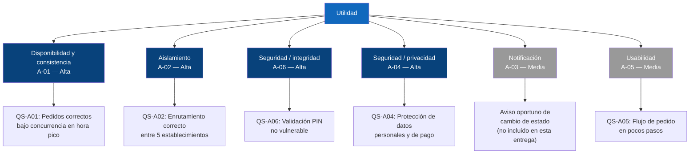

# Aspectos De Calidad 

> Este documento registra los atributos de calidad considerados para el desarrollo del proyecto **La placita**, así como la trazabilidad de las decisiones arquitectónicas (ADR) y las diferentes evidencias durante el desarrollo del proyecto.

---

# 1. Aspectos del sistema 

| **ID**   | **Aspecto**                                | **Requisito**   | **C4**    | **ADR**   | **Código**   | **Pruebas**   | **Evidencia**   |
| -------- | ---------------------------------------------------------- | --------------- | --------- | --------- | ------------ | ------------- | --------------- |
| A-01     | Disponibilidad y consistencia del estado de los pedidos    | RF-01           | Pendiente | Pendiente | Pendiente    | Pendiente     | Pendiente       |
| A-02     | Aislamiento y enrutamiento correcto entre establecimientos | RF-02           | Pendiente | Pendiente | Pendiente    | Pendiente     | Pendiente       |
| A-03     | Notificación oportuna del cambio de estado                 | RF-03           | Pendiente | Pendiente | Pendiente    | Pendiente     | Pendiente       |
| A-04     | Protección de datos personales y de pago                   | RF-04           | Pendiente | Pendiente | Pendiente    | Pendiente     | Pendiente       |
| A-05     | Simplicidad del flujo de navegación y pedido | RF-05           | Pendiente | Pendiente | Pendiente    | Pendiente     | Pendiente       |
| A-06     | Integridad en la validación de identidad en el punto de recolección | RF-06           | Pendiente | Pendiente | Pendiente    | Pendiente     | Pendiente       |

--- 

# 2. Descripción de Aspectos

## Aspecto A-01

**Nombre:** Disponibilidad y consistencia del estado de los pedidos.

**Usuario:** Estudiantes, docentes, personal administrativo y establecimiento de LaPlacita.

**Problema Que Resuelve:** Durante las horas de mayor demanda pueden existir múltiples pedidos realizados simultáneamente. El sistema debe mantenerse disponible y, al mismo tiempo, garantizar que el estado de cada pedido sea correcto y consistente para evitar confusiones entre los usuarios y los establecimiento.

**Resultado Esperado:** El sistema permite registrar y consultar pedidos de manera confiable, manteniendo actualizado su estado durante las diferentes etapas del proceso: Pedido recibido, en preparación, listo para recoger y entregado.

**Escenario:** Durante una hora de alta demanda, varios usuarios realizan pedidos simultáneamente desde la aplicación. El sistema debe procesar las solicitudes y mantener correctamente asociado cada pedido con su usuario y establecimiento correspondiente.

**Criterio De Éxito:** Ningún pedido debe perderse, duplicarse o mostrar un estado incorrecto como consecuencia de la concurrencia de solicitudes.

**Prioridad:** Alta.

**Estado:** En analsisis.

## Aspecto A-02

**Nombre:** Aislamiento y enrutamiento correcto entre establecimientos.

**Usuario:** Establecimientos de LaPlacita y personal administrivo.

**Problema Que Resuelve:** LaPlacita agrupa varios establecimientos independientes que operan bajo la misma plataforma. Si el sistema no aísla correctamente los datos de cada establecimiento (pedidos, menú, inventario), un pedido podría enrutarse al negocio equivocado, o un establecimiento podría ver o modificar información que no le pertenece, generando errores operativos y desconfianza entre los vendedores.

**Resultado Esperado:** El sistema garantiza que cada pedido, menú e inventario esté correctamente asociado a su establecimiento correspondiente, y que cada establecimiento solo pueda consultar y gestionar su propia información dentro de la plataforma.

**Escenario:** Un usuario realiza un pedido que incluye productos de dos establecimientos distintos dentro de LaPlacita. El sistema debe dividir o asociar correctamente cada parte del pedido con el establecimiento que debe prepararlo, sin mezclar productos, inventario o notificaciones entre negocios.

**Criterio De Éxito:** Ningún establecimiento debe recibir, visualizar o modificar pedidos, menús o inventario que no le pertenezcan, incluso bajo condiciones de alta concurrencia.

**Prioridad:** Alta

**Estado:** En análisis

## Aspecto A-03

**Nombre:** Notificación oportuna del cambio de estado del pedido.

**Usuario:** Estudiantes, docentes y personal administrativo que realizan pedidos enLaPlacita.

**Problema Que Resuelve:** Los usuarios necesitan saber en qué momento su pedido pasa de una etapa a otra (recibido, en preparación, listo para recoger, entregado) sin tener que consultar manualmente la aplicación de forma constante. Una demora significativa en la notificación puede generar filas innecesarias, confusión o que el usuario no recoja su pedido a tiempo.

**Resultado Esperado:** El sistema informa al usuario de manera oportuna cada vez que el estado de su pedido cambia, en especial cuando pasa a "listo para recoger", permitiéndole planificar el momento de acercarse al establecimiento.

**Escenario:** Un establecimiento marca un pedido como "listo para recoger" durante una hora de alta demanda. El sistema debe notificar al usuario correspondiente dentro de un tiempo razonable, incluso si en ese momento se están procesando múltiples cambios de estado de otros pedidos simultáneamente.

**Criterio De Éxito:** El usuario recibe la notificación del cambio de estado dentro de un margen de tiempo aceptable definido por el equipo, sin pérdidas ni retrasos significativos, incluso bajo concurrencia alta.

**Prioridad:** Media

**Estado:** En análisis

## Aspecto A-04

**Nombre:** Protección de datos personales y de pago.

**Usuario:** Estudiantes, docentes, personal administrativo y establecimientos de LaPlacita.

**Problema Que Resuelve:** El sistema maneja información sensible de sus usuarios (datos personales asociados a su identidad institucional) y datos relacionados con el pago de pedidos, ya sea en línea o presencial. Un manejo inadecuado de esta información puede exponer a los usuarios a riesgos de privacidad o generar desconfianza hacia la plataforma.

**Resultado Esperado:** El sistema protege la información personal y de pago de los usuarios, limitando su acceso únicamente a quienes la necesitan (el propio usuario, el establecimiento correspondiente y el personal administrativo autorizado), y evita almacenar directamente información sensible de pago cuando existan medios de pago en línea a través de un tercero.

**Escenario:** Un usuario realiza un pedido pagando en línea a través de una pasarela de pago externa. El sistema debe registrar únicamente la confirmación del pago (sin almacenar datos sensibles de la tarjeta) y mantener los datos personales del usuario accesibles solo para los roles autorizados.

**Criterio De Éxito:** Ningún dato personal o de pago sensible debe quedar expuesto a establecimientos u otros usuarios sin autorización, y no debe almacenarse información de tarjetas u otros medios de pago sensibles directamente en el sistema.

**Prioridad:** Alta

**Estado:** En análisis

## Aspecto A-05

**Nombre:** Simplicidad del flujo de navegación y pedido.

**Usuario:** Estudiantes, docentes y personal administrativo que realizan pedidos en LaPlacita.

**Problema Que Resuelve:** Un proceso de pedido con demasiados pasos, pantallas o campos innecesarios desincentiva el uso de la plataforma, especialmente en momentos donde el usuario dispone de poco tiempo (entre clases, en descansos cortos). El sistema debe minimizar la fricción desde que el usuario abre la aplicación hasta que confirma su pedido.

**Resultado Esperado:** El usuario puede completar un pedido (buscar producto, seleccionarlo y confirmarlo) en la menor cantidad de pasos e interacciones posible, sin pantallas ni campos redundantes.

**Escenario:** Un estudiante con 5 minutos disponibles entre clases abre la aplicación, busca un producto específico, lo agrega al pedido y lo confirma antes de que termine su tiempo libre, sin tener que navegar por pantallas innecesarias.

**Criterio De Éxito:** El flujo completo de pedido no debe exceder el número máximo de pasos o pantallas definido como aceptable por el equipo, medido desde la apertura de la aplicación hasta la confirmación del pedido.

**Prioridad:** Media

**Estado:** En análisis

## Aspecto A-06

**Nombre:** Integridad en la validación de identidad en el punto de recolección.

**Usuario:** Establecimientos de LaPlacita y usuarios que recogen su pedido.

**Problema Que Resuelve:** Como la seguridad se concentra en el PIN de 4 dígitos entregado en el punto de recolección (y no durante la navegación), es crítico que ese mecanismo no pueda ser vulnerado: adivinado por fuerza bruta, interceptado, o reutilizado después de una entrega ya realizada. Si el PIN no tiene controles de integridad, cualquier persona con el número correcto (o con varios intentos) podría recoger un pedido ajeno.

**Resultado Esperado:** El sistema garantiza que cada PIN sea válido para un único pedido, no pueda reutilizarse una vez la entrega fue confirmada, y limite los intentos fallidos de validación para prevenir adivinanza por fuerza bruta.

**Escenario:** Una persona intenta validar un pedido usando un PIN incorrecto varias veces seguidas en el mostrador. El sistema debe bloquear o alertar tras un número limitado de intentos fallidos, y el PIN correcto ya usado en una entrega anterior no debe volver a ser aceptado como válido.

**Criterio De Éxito:** Ningún pedido debe ser entregado dos veces con el mismo PIN, y el sistema debe limitar los intentos fallidos de validación a un número máximo definido por el equipo.

**Prioridad:** Alta

**Estado:** En análisis

## 3. Árbol de Utilidad y Escenarios de Calidad

### 3.1 Árbol de utilidad

### 3.2 Escenarios de calidad

**QS-A01 — Disponibilidad y consistencia**
- **Fuente:** usuarios del campus
- **Estímulo:** múltiples pedidos simultáneos durante hora pico
- **Artefacto:** backend / servicio de gestión de pedidos
- **Entorno:** operación normal, hora pico
- **Respuesta:** cada pedido se procesa y asocia correctamente a su usuario y establecimiento, sin pérdida ni duplicación
- **Medida:** 0 pedidos perdidos o duplicados en pruebas con 100 solicitudes concurrentes; disponibilidad ≥ 99% en la ventana de almuerzo

**QS-A02 — Aislamiento entre establecimientos**
- **Fuente:** usuario que ordena productos de dos establecimientos distintos en un mismo pedido
- **Estímulo:** el pedido se envía al backend
- **Artefacto:** módulo de enrutamiento de pedidos
- **Entorno:** operación normal
- **Respuesta:** cada parte del pedido se asocia solo al establecimiento correspondiente, sin mezclar menú, inventario ni notificaciones entre negocios
- **Medida:** 0% de pedidos/datos visibles o modificables por un establecimiento distinto al asignado, en pruebas con los 5 establecimientos activos simultáneamente

**QS-A06 — Integridad de la validación PIN/QR**
- **Fuente:** persona que no es el dueño del pedido
- **Estímulo:** intenta validar la entrega con un PIN incorrecto varias veces seguidas, o reutiliza un PIN ya usado
- **Artefacto:** módulo de validación de identidad en el punto de recolección
- **Entorno:** mostrador de entrega, operación normal
- **Respuesta:** el sistema bloquea el intento tras un número límite de fallos y rechaza un PIN ya usado en una entrega anterior
- **Medida:** máximo 3 intentos fallidos antes de bloqueo; 0% de entregas exitosas con PIN reutilizado en pruebas

**QS-A04 — Protección de datos personales y de pago**
- **Fuente:** usuario que paga en línea a través de la pasarela externa
- **Estímulo:** se confirma el pago del pedido
- **Artefacto:** backend / módulo de pagos
- **Entorno:** operación normal
- **Respuesta:** el sistema registra solo la confirmación del pago, sin almacenar datos sensibles de la tarjeta, y mantiene los datos personales visibles solo para el usuario, su establecimiento y el personal autorizado
- **Medida:** 0 campos de datos de tarjeta almacenados en base de datos; acceso a datos personales limitado a los 3 roles autorizados en pruebas de control de acceso

**QS-A05 — Usabilidad / simplicidad del flujo**
- **Fuente:** estudiante con una ventana de 5 minutos entre clases
- **Estímulo:** abre la app para hacer un pedido específico
- **Artefacto:** flujo de navegación y checkout
- **Entorno:** uso normal
- **Respuesta:** completa el pedido sin pantallas ni campos redundantes
- **Medida:** pedido completado en ≤ 5 pasos / ≤ 2 minutos, con tasa de éxito ≥ 90% en pruebas de usabilidad
