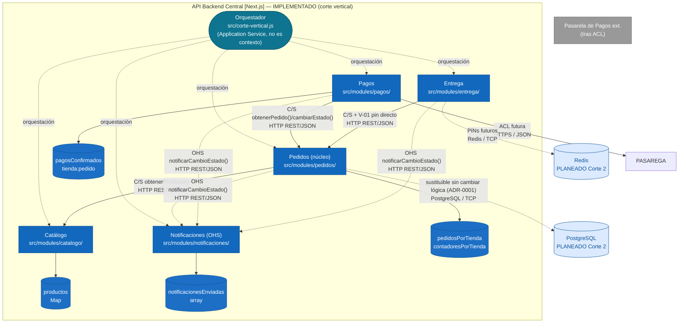

# Diagrama de Componentes — LaPlacita 

> Descompone **API Backend Central** (ver `contenedores.md`) en los 5 Bounded Contexts + orquestador + stores. Niveles 1-2 intactos (ADR-0005: reajuste de precisión, no de contenedores).

## Leyenda de colores

| Color en el diagrama | Significado |
| --- | --- |
| Azul brillante (`container`) | Bounded Context de dominio implementado (Catálogo, Pedidos, Pagos, Entrega, Notificaciones). |
| Azul medio (`containerDb`) | Almacén interno del contexto (`Map` / array en memoria). |
| Azul petróleo (`appService`) | Orquestador / Application Service — no es un contexto de dominio. |
| Azul claro (`planned`) | Contenedor **planeado (Corte 2)**: aún sin implementación, se documenta su rol previsto. |
<<<<<<< HEAD
| Gris (`System_Ext`) | Servicio externo integrado fuera del control del equipo. |
| Línea delimitadora (`System_Boundary`) | Frontera lógica que agrupa los contenedores internos de La Placita. |
| $\rightarrow$ Flechas con etiqueta | Relación de comunicación; la etiqueta indica qué se intercambia y el protocolo (HTTP REST/JSON, import ESM síncrono, REST, SQL, TCP). |
=======
| Gris (`extSystem`) | Sistema externo integrado fuera del control del equipo. |
| $\rightarrow$ Flechas con etiqueta | Relación de comunicación; la etiqueta indica qué se intercambia y el patrón (C/S, OHS, ACL). |
>>>>>>> e706ab1 (Ajuste de colometria de c4, componentes.md)
