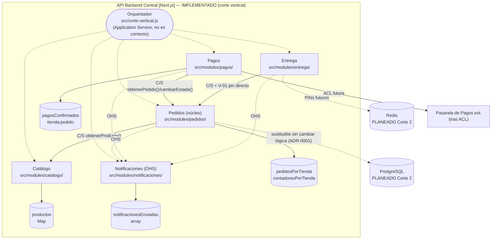

# Diagrama de Componentes — LaPlacita 

> Descompone **API Backend Central** (ver `contenedores.md`) en los 5 Bounded Contexts + orquestador + stores. Niveles 1-2 intactos (ADR-0005: reajuste de precisión, no de contenedores).

## Leyenda de colores

| Color en el diagrama | Significado |
| --- | --- |
| Azul oscuro (`Person`) | Actor humano que opera las aplicaciones del sistema. |
| Azul brillante (`Container` / `ContainerDb`) | Aplicación, API o base de datos que forma parte de La Placita. |
| Azul claro (`planned`) | Contenedor **planeado (Corte 2)**: aún sin implementación, se documenta su rol previsto. |
| Gris (`System_Ext`) | Servicio externo integrado fuera del control del equipo. |
| Línea delimitadora (`System_Boundary`) | Frontera lógica que agrupa los contenedores internos de La Placita. |
| $\rightarrow$ Flechas con etiqueta | Relación de comunicación; la etiqueta indica qué se intercambia y el protocolo (REST, SQL, TCP). |
