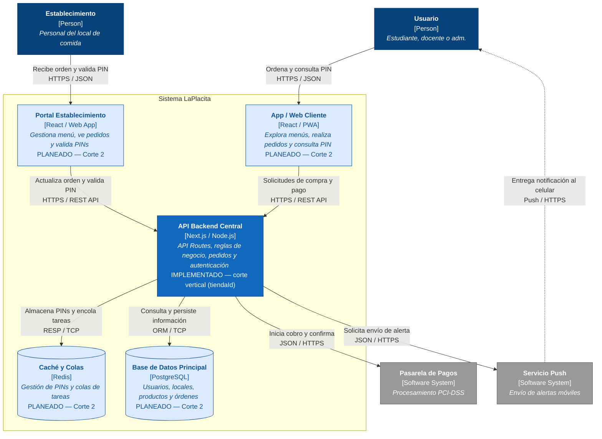

# Diagrama de Contenedores — La Placita

> Nivel C4: Contenedores del sistema. Muestra las aplicaciones, APIs, bases de datos e integraciones que componen la plataforma La Placita.

## Leyenda de colores

| Color en el diagrama | Significado |
| --- | --- |
| Azul oscuro (`Person`) | Actor humano que opera las aplicaciones del sistema. |
| Azul brillante (`Container` / `ContainerDb`) | Aplicación, API o base de datos que forma parte de La Placita. |
| Azul claro (`planned`) | Contenedor **planeado (Corte 2)**: aún sin implementación, se documenta su rol previsto. |
| Gris (`System_Ext`) | Servicio externo integrado fuera del control del equipo. |
| Línea delimitadora (`System_Boundary`) | Frontera lógica que agrupa los contenedores internos de La Placita. |
| $\rightarrow$ Flechas con etiqueta | Relación de comunicación; la etiqueta indica qué se intercambia y el protocolo (REST, SQL, TCP). |

## Estado de implementación

| Contenedor | Estado | Evidencia |
| --- | --- | --- |
| API Backend Central | Implementado (`tiendaId` en todo el flujo) | `src/modules/*`, `src/corte-vertical.js`, `tests/aislamiento.test.js` |
| App / Web Cliente | Planeado (Corte 2) | — |
| Portal Establecimiento | Planeado (Corte 2) | — |
| Caché y Colas (Redis) | Planeado (Corte 2) | — |
| Base de Datos Principal (PostgreSQL) | Planeado (Corte 2) | — |