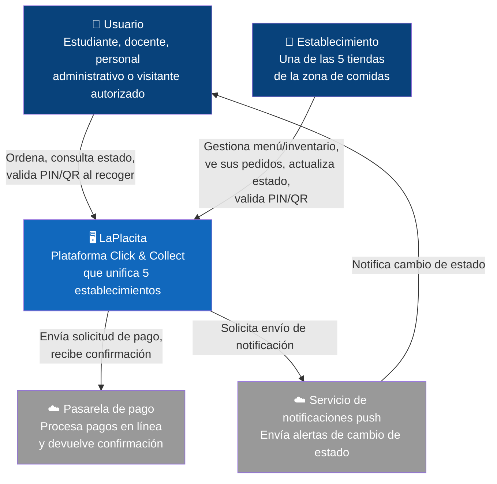

# Diagrama de Contexto — La Placita

> Nivel C4: Contexto del sistema. Muestra qué actores interactúan con el sistema y qué sistemas externos lo rodean.

## Leyenda de colores

| Color en el diagrama | Significado |
|----------------------|-------------|
| 🟦 Azul (Person) | Actor humano que interactúa directamente con el sistema. |
| 🟨 Amarillo / gris claro (System) | El sistema propio — La Placita. |
| 🟫 Gris oscuro (System_Ext) | Sistema externo fuera del control del equipo. |
| → Flechas con etiqueta | Relación de comunicación; la etiqueta indica qué se intercambia y el protocolo. |
