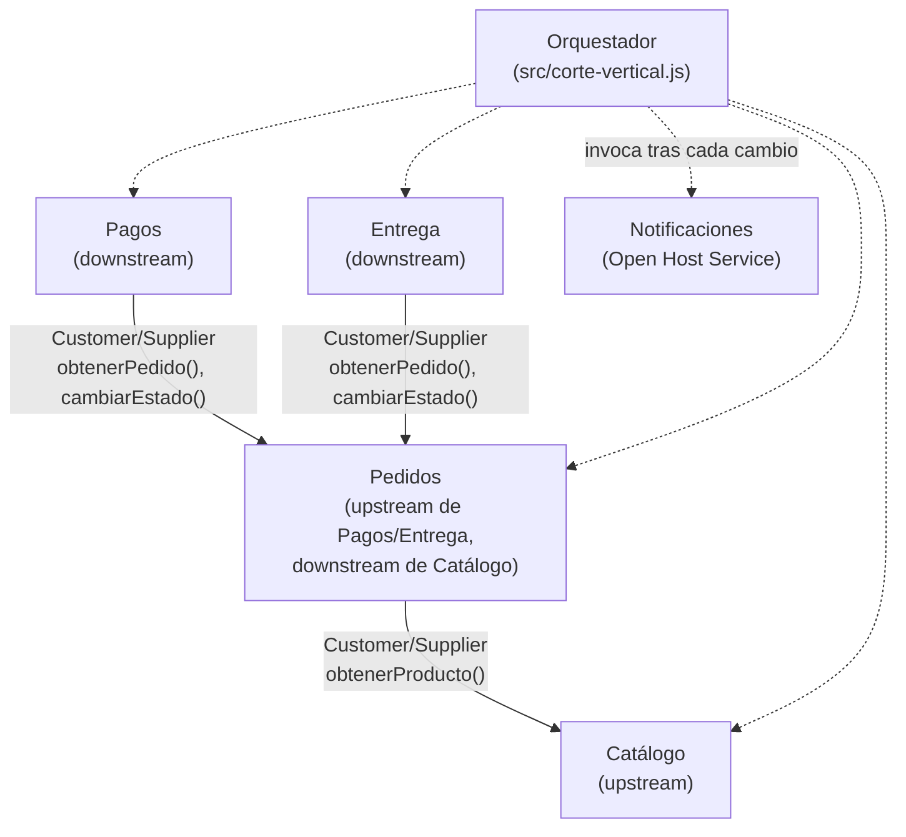

# Mapa de Contextos — La Placita

## Relaciones

| Relación | Patrón DDD | Descripción |
| --- | --- | --- |
| Pedidos → Catálogo | Customer/Supplier | Pedidos consulta `obtenerProducto` para validar precio y pertenencia a tienda antes de crear el pedido. |
| Pagos → Pedidos | Customer/Supplier | Pagos lee el pedido y solo puede avanzar su estado a "En preparación" vía `cambiarEstado`. |
| Entrega → Pedidos | Customer/Supplier | Entrega lee el pedido y avanza su estado a "Listo"/"Entregado" vía `cambiarEstado`. |
| Notificaciones | Open Host Service | Expone `notificarCambioEstado` sin depender de ningún otro contexto; no es invocada directamente por Pedidos/Pagos/Entrega, sino por el orquestador. |

## Nota
El orquestador (`src/corte-vertical.js`) no es un contexto de dominio: es la capa de composición que atraviesa los 5 módulos en un solo flujo. No tiene lenguaje ubicuo propio ni datos propios.
